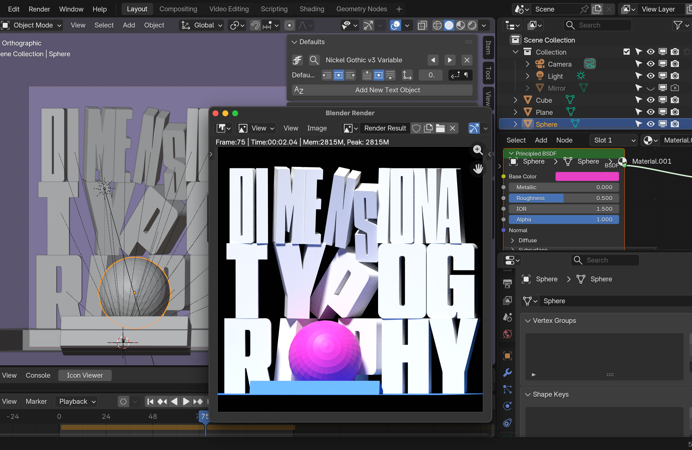

- [Download Blender 5.1.2](https://www.blender.org/download/)

- [Download ST2](https://coldtype.xyz/st2/releases/ST2-v0-24.zip)

- Optional for the Keyboard-Oriented Among You:
    - [Download UV](https://docs.astral.sh/uv/getting-started/installation/)
    - `uv run coldtype demo`
    - `uv run coldtype noordzij` (experimental)

